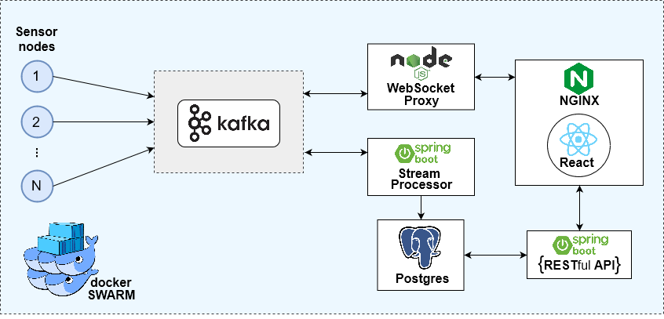

## Architecture

In this section, the logical level of the architecture is presented, providing an overview and, therefore, a better understanding about the whole system. 
Each component is described below, along with their functionalities.

 

  

#### Sensor nodes
Information is constantly being sent from sensors to the Kafka broker.

#### Kafka
The Kafka broker is in the middle of the processing of the information. Four topics are currently implemented:

* **updates**: receives original information sent by the sensors

* **alerts-speed**: receives speed data of the bicycle that surpasses a certain speed limit.

* **alerts-battery**: receives battery level data that surpasses a certain limit.

* **alerts-heartrate**: receives heartrate data of the bicycle user that surpasses a certain limit.

#### Stream Processor
Data is read from all Kafka topics and then processed. It processes alerts and stores the information in the database (persitence).

#### WebSocket Proxy
Kafka proxy that connects the Kafka Cluster and the Dashboard (which uses NGINX and React).

#### PostgreSQL
A PostgreSQL database will be used to store relevant data, providing faster querying and lookup.

#### Restful API
Collects data from database to be shown on the user interface (client)

#### Nginx
A Nginx web server is used to host the Dashboard.

#### React
Javascript library used for the construction of the user interface (Dashboard).

#### Docker Swarm
Docker Swarm is a Docker native tool which allows the creation of Docker clusters. This means it is possible to have multiple Docker hosts in the same resources "pool", making it easier to deploy containers.