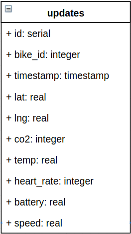

#Data Model

In this section, basic concepts and relations used in the platform's data model are shown.

**Fleet** keeps track of all information provided by the sensors attached to each bicycle. For each bicycle, it is necessary to store a number internal to the bike rental shop.

A **bicycle** belongs to a **bike rental shop**. 
Each bicycle has sensors and information is sent from them to a Kafka **broker**. Then, the data is made available on the Web API. This last one contains a **dashboard** where information about bicycles currently in circulation is shown. **Alerts** may also appear when some abnormal activity occurs.

All relevant information (bicycles' location, heart rate of the clients, battery level of the sensors, and others) will be displayed in that same dashboard.

Alerts are triggered in the dashboard. This happens, when:

* the **heart rate** of a user is showing abnormal values

* the **battery level** is becoming very low

* the bicycle is going **too slow**

 

 

 

| Parameter     | Type    | Description             |
| --------------|-------- |:-----------------------------------------|
| id       		| serial		  |	ID of the alert |
| bike_id       | integer		  |	ID of the bicycle |
| timestamp     | timestamp		  |	Timestamp of the alert |
| lat           | real		  |	Latitude of the bicycle |
| lng           | real		  |	Longitude of the bicycle |
| co2           | integer   	  |	The CO2 existent in the sorrounding atmosphere|
| temp          | real 		  |	Current temperature  |
| heart_rate    | integer		  |	Heart rate of the client who rented the bicycle |
| battery       | real		  |	Battery level of the sensor(s) |
| speed         | real		  |	Speed of the bicycle |
