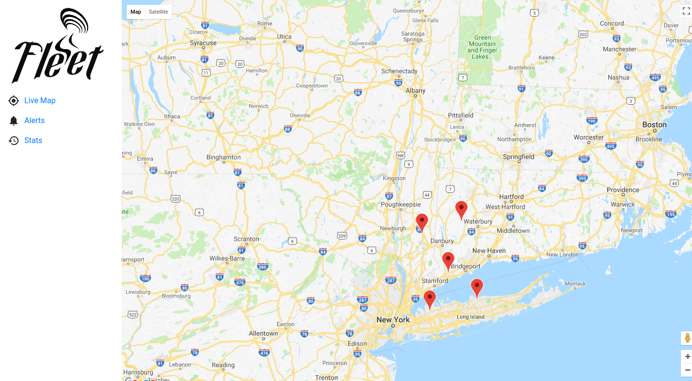
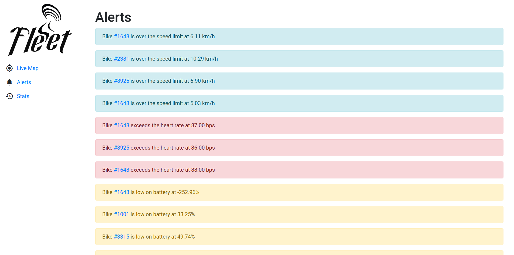
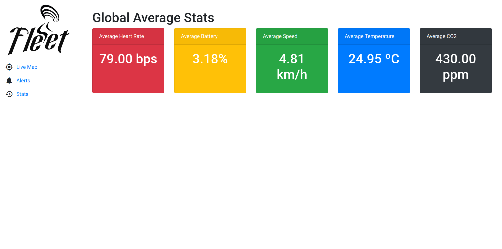
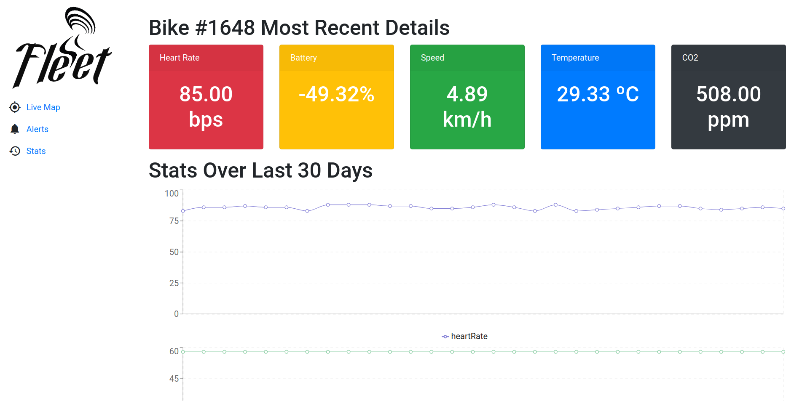
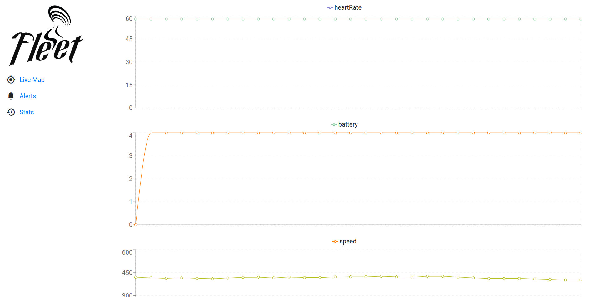
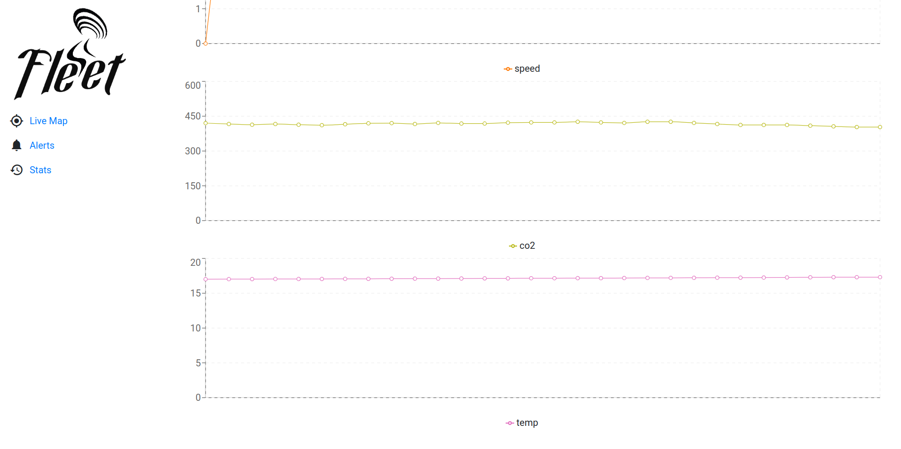

##Manual

 

#### Homepage

 
The image above is a screenshot of the main page of our app. A google map is displayed, and the user may see the bicycles (represented by red dots) moving along the area.
On the left side, there is a navigation panel, which transports the user to different pages of our app.
The user may click on a bicycle to see the bicycle's stats (see <a  href="#stats">Stats page</a>).
 

 

#### Alerts page

 
Clicking on the "Alerts" section of the navigation panel, the user can monitor the alerts being sent to the app. These alerts have different colours, according to their category:

> Battery level alerts: **yellow**

> Heart rate alerts: **red**

> Speed alerts: **blue**

The user can click on the bicycle id and see the bicycle's stats (see <a  href="#stats">Stats page</a>).

 

 

<h4 id="stats">Stats page</h4>

Finally, by clicking on the "Stats" section, the user will see global average stats about:

> Heart rate

> Average battery 

> Average speed

> Average temperature

> Average CO2

 

If the user clicked on a certain bicycle on the map or a bicycle id on the alerts page, the following page will be shown, showing stats about the selected bicycle and respective graphs:

---

---

