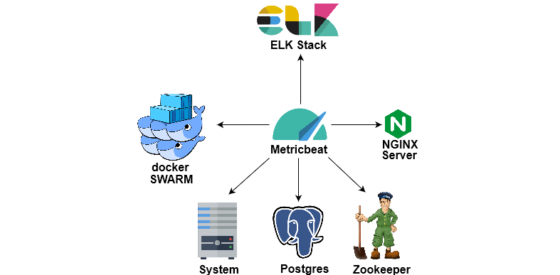

## Monitorization

In this section, the monitorization technologies and their interactions are showcased.

 

  

####Docker Swarm
Docker Swarm obtains information from the various containers.

#### Zookeeper
Kafka servers depend on Zookeeper.

####Postgres
Database storing relevant data, providing fast querying and lookup.

#### Metricbeat
Metricbeat monitors the created containers by collecting metrics from them.

[Installation and getting started guide](https://www.elastic.co/downloads/beats/metricbeat)

#### ELK Stack
Stores information collected by Metricbeat and allows for fast searching and visualization of the metrics collected.

[What is the ELK Stack?](https://www.elastic.co/elk-stack)

#### Nginx
Nginx web server used to host the Dashboard.

#### System
System hosting the solution.