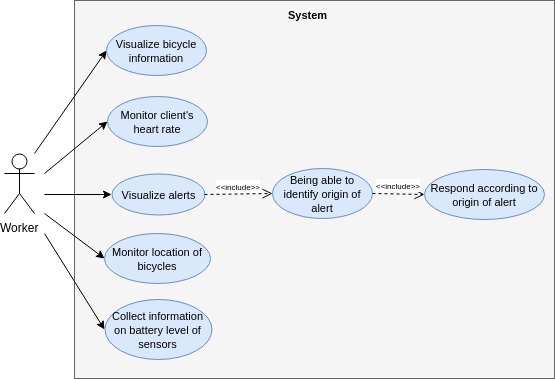

#Use Cases

  

 

| UC-1        | Visualize bicycle information             |
| ----------------- |:-----------------------------------------|
| Description       | The worker of the bike rental shop must be able to get information on a certain bicycle (for instance, the identification of the bicycle (number) and current speed of it)                              |
| Priority          | High |
| Other information | -    |

 

| UC-2              | Monitor client's heart rate                      |
| ----------------- |:------------------------------------------------|
| Description       | The worker will monitor the client's heart rate, so he/she can respond accordingly.  |
| Priority          | High |
| Other information | -    |

 

| UC-3      | Visualize alerts              			 |
| ----------------- |:------------------------------------------|
| Description       | The worker will get alerts when the heart rate of the client is showing abnormal values and when the speed of the bicycle and battery of the sensors are too low. |
| Priority          | High |
| Other information | -    |

 

| UC-4         | Being able to identify origin of alert |
| ----------------- |:--------------------------------------|
| Description       | The worker is able to identify the origin of the alert, by analysing the dashboard in which the alerts will appear.                                       |
| Priority          | High |
| Other information | -    |

 

| UC-5         | Respond according to origin of alert |
| ----------------- |:--------------------------------------|
| Description       | The worker will take measures to normalize the values received in the alerts.                                      |
| Priority          | High |
| Other information | -    |

 

| UC-6         | Monitor location of bicycles |
| ----------------- |:--------------------------------------|
| Description       | With the help of a map, the worker will know the location of the bicycles currently being used by clients of the shop.      |
| Priority          | High |
| Other information | -    |

 

| UC-7         | Collect information on battery levels of sensors |
| ----------------- |:--------------------------------------|
| Description       | The worker will know when the battery of a certain sensor attached to a bicycle is running low. The worker will proceed to recharge said battery, if it doesn't belong to a bicycle currently rented.  |
| Priority          | High |
| Other information | -    |